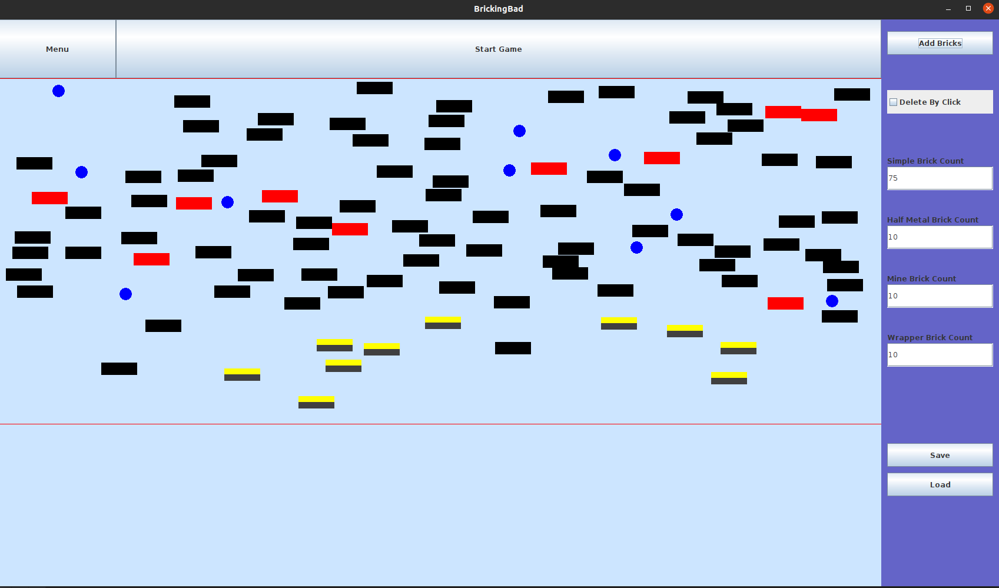
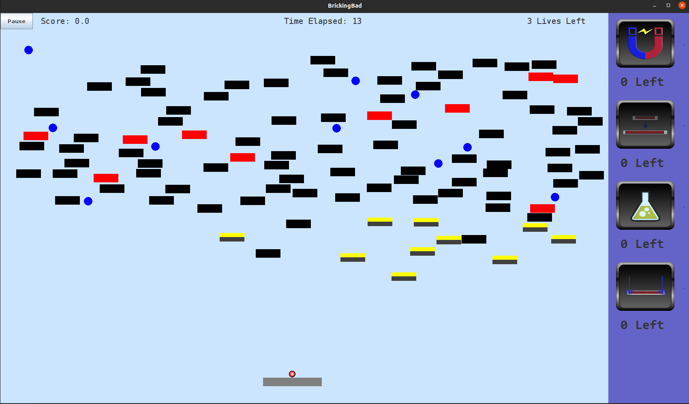
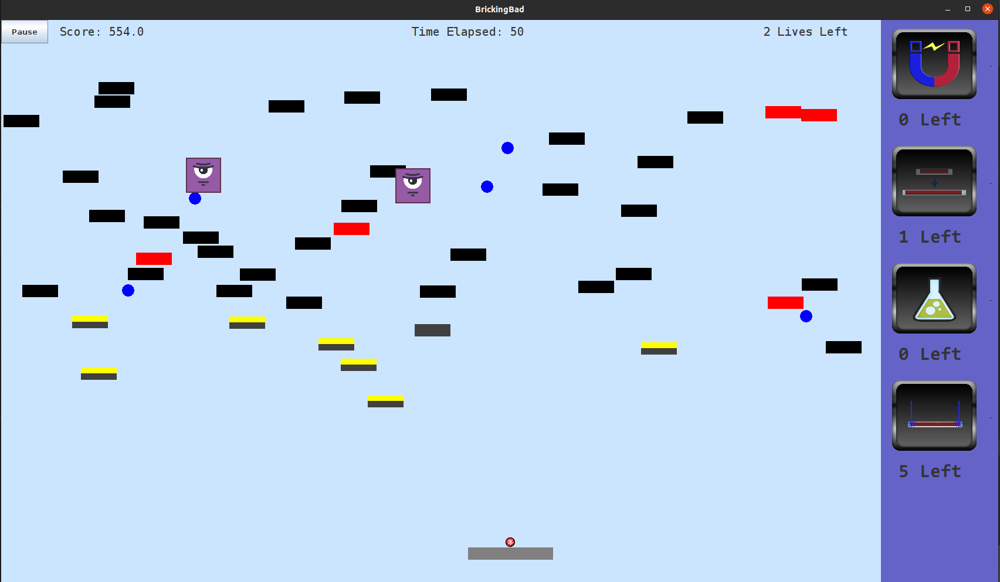
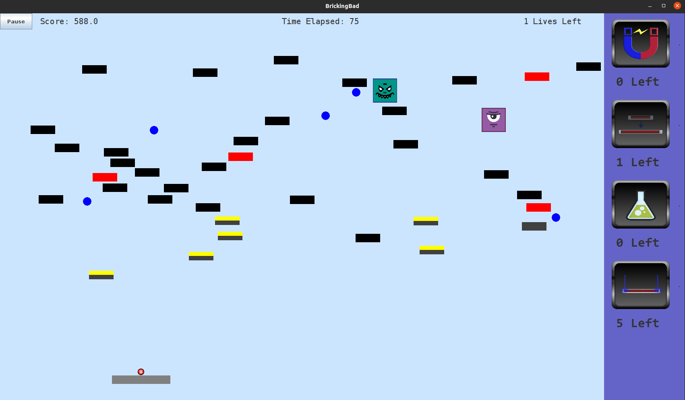

## Code

The code is available on github [here](https://github.com/Shamdan17/Bricking_Bad).

## Skills

* Software Engineering
* Software Patterns
* Java
* Teamwork
* Agile Development

## About

This project is part of the COMP302 Software Engineering course at Koç University.

In this project we work in a team of 5 to develop a game following certain requirements put forth
by the course instructor.

The goal of the project was to practice agile development style, and apply software patterns learned during
the course to medium scale project.

We developed a game called Bricking Bad. In this game the player control a paddle that can move right and left, and can tilt also in both directions. The player can design
a map that contains bricks of different kinds. Also, aliens of different abilities can appear in the middle of the game to hinder the player from reaching his goal which is
destroying all the bricks on the map.

The game starts with a ball placed on the paddle. Then the ball can be fired towards the bricks and it can be bounced of bricks or destroy them depending on their type.
The player must not let the ball fall beyond the paddle, and if it does, the player loses a life. The game is over when the player loses all the lives and the there are still some unbroken bricks. The player wins win all bricks are destroyed.

In addition, there are several power-ups that can be used by the player to increase the performance of the ball or paddle. This whole combination of different bricks, aliens and power-ups makes it a simple yet challenging game to play.

